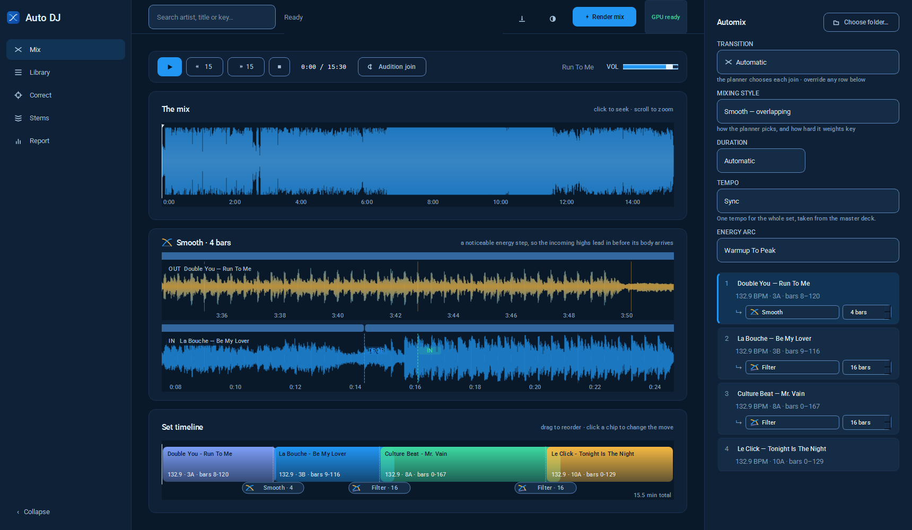
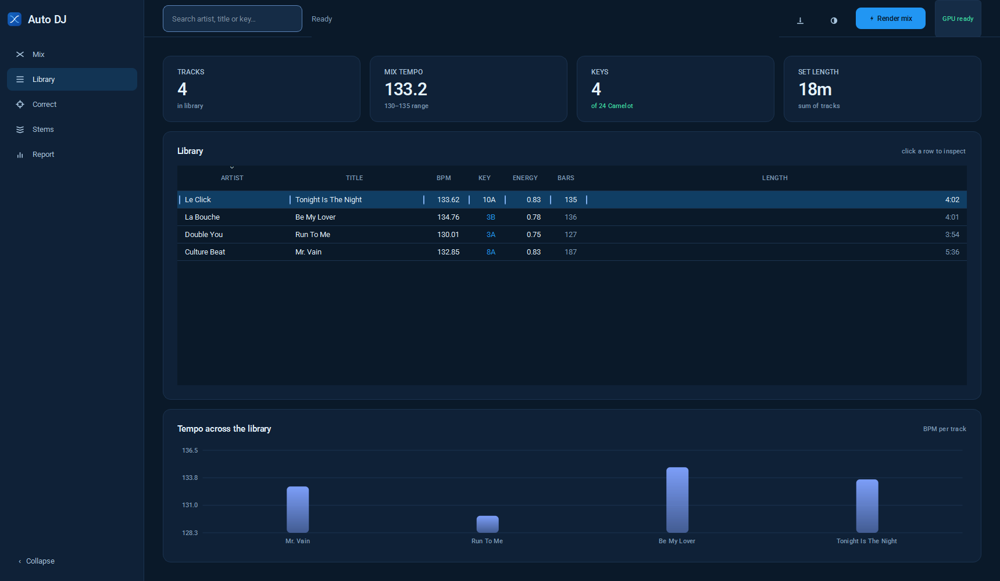
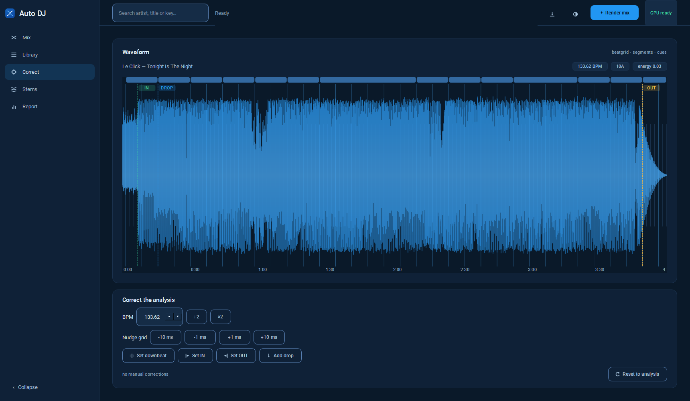
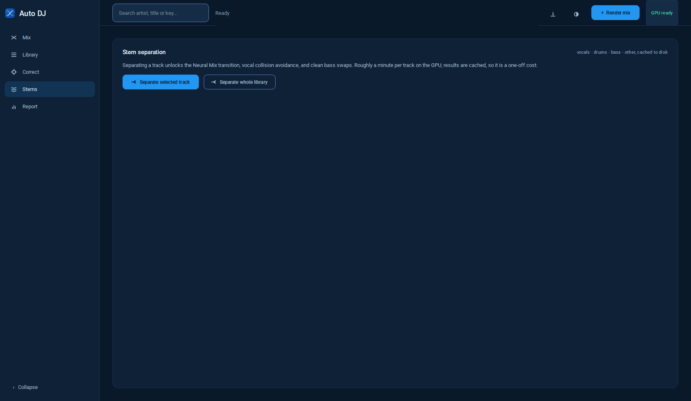
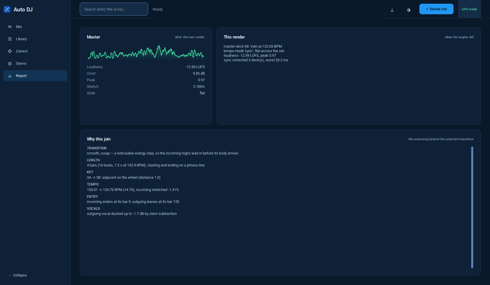

# Auto DJ Mix

Point it at a folder of music. It analyses every track, plans a setlist along an
energy arc, and renders one continuous beatmatched mix — then lets you listen to
it, edit it, and hear each change immediately.

```powershell
python main.py --gui                                  # the desktop app
python main.py --input musica --output output/mix.wav --mp3
python main.py --input musica --duration auto --tempo blend --audition --mp3
python main.py --convert output/mix.wav               # WAV stays, MP3 alongside
```

## The application

Two panes, after djay's Automix layout: decks on the left, the Automix queue on
the right. Five views in the sidebar.

| View | What it is for |
|---|---|
| **Mix** | Transport, the whole mix as one waveform with a playhead, the two tracks at the selected join stacked with their beatgrids, and the set timeline |
| **Library** | Every analysed track — BPM, Camelot key, energy, bars, length |
| **Correct** | Fixing what the analysis got wrong: BPM, downbeat, IN/OUT, drops |
| **Stems** | Separation, which unlocks Neural Mix and vocal collision avoidance |
| **Report** | The master chain figures, and *why* each join is what it is |

`Space` plays, `A` auditions the selected join, `Ctrl+R` renders, `Ctrl+S`
exports, `Ctrl+O` opens a folder, `Ctrl+D` switches between dark and light.

**Transition** in the Automix panel sets the move for the whole set —
*Automatic* leaves each join to the planner, anything else applies everywhere,
and any row can still override it. **Mixing style** below it is the planner's
bias (which moves it reaches for, how hard it weights key), so it is disabled
whenever a transition is pinned.

### The design system

`gui/theme.py` holds every colour, size, type step and motion curve, and
generates the stylesheet from them. Two palettes, both built on the same four
blues — `#0D47A1`, `#2196F3`, `#90CAF9`, `#E3F2FD`.

Tokens are split by *role* rather than by appearance, because WCAG asks
different things of each: a decorative hairline has no contrast requirement, a
control edge and a focus ring need 3:1, and text needs 4.5:1. One "border"
colour forces a choice between an invisible focus ring and a design shouting
through heavy boxes; three tokens let the hairline stay quiet and the ones that
carry meaning be loud enough to see.

```powershell
python -m autodj.gui.theme     # audits every colour pair the app can produce
```

154 pairs, both modes, all passing. The audit is the reason the palette is
trustworthy: it caught a focus ring drawn in the same indigo as the button it
outlined (1.00:1), structure segments that measured 1.71 and were effectively
invisible, and a hover fill that missed AA by three hundredths.

Motion lives in `gui/motion.py`. Qt's stylesheet engine has no `transition`, so
the cubic-beziers are rebuilt as `QEasingCurve` and run by `QPropertyAnimation`
— 90ms for colour, 150ms for small transforms, 200ms for panels, 280ms for the
sidebar. Nothing animates on hover: on a tool this dense that reads as lag.

### Editing a mix

The queue's rows each carry the join that follows them. Change a transition or
its length and the join alone re-renders and plays — about two seconds, against
a minute for the set — because most of a full render is the master chain over
fifteen minutes of audio, and a preview masters thirty seconds.

Blocks in the timeline drag to reorder. Cue markers on the waveform drag
directly.

## The screens



**Mix** — transport, the whole rendered set as one waveform, the two tracks at
the selected join stacked with their beatgrids, and the editable set timeline.
The Automix column on the right carries the set-wide settings and one row per
track, each holding the join that follows it.



**Library** — every analysed track with BPM, Camelot key, energy, bars and
length, and the tempo spread across the folder.



**Correct** — fixing what the analysis got wrong. Arm a mode and click the
waveform: the click is a statement about the music, and it is fed back *into*
analysis rather than patched onto the result.



**Stems** — separation into vocals / drums / bass / other, which is what
unlocks Neural Mix and vocal-collision avoidance.



**Report** — the master chain's measured figures, and why each join is what it
is.

Light mode is the same five screens under `demos/gui/light_*.png`; `Ctrl+D`
switches. Both palettes are built from the same four blues and both pass WCAG
AA on all 154 colour pairs the app can produce.


## Transitions

| Name | What it does |
|---|---|
| Automatic | The planner decides, and keeps deciding as the set changes |
| Dissolve | Equal-power cross with a bass handover |
| Smooth | A dissolve whose incoming highs lead in first |
| Fade | The plain crossfader move, no EQ at all |
| Filter | Outgoing climbs away under a highpass; incoming opens up |
| EQ / EQ blend | Three-band automation around a bass switch |
| Echo | Outgoing cut on a downbeat and left ringing in a delay |
| **Reverb wash** | Outgoing dissolves into its own reverb tail; incoming enters dry |
| **Ladder filter** | `Filter`, but through a resonant 24 dB/oct ladder that sings as it climbs |
| **Neural Mix** | Mixed stem by stem: drums hand over, then harmony, then vocals |
| Cut / Cut + echo | Hard swap on the 1, nothing overlapping |
| Loop roll | Outgoing eats its own tail, accelerating into the cut |
| Riser | A synthesised sweep lands on the cut |
| **Tremolo** | Outgoing chopped at an accelerating rate, then swapped |
| **Double drop** | Both tracks' drops aligned to the same bar, both playing through |
| Vocal slam | Outgoing cut dead on the incoming vocal |
| Rap breakout | Incoming rides highpassed over the outgoing groove, then the bass lands |

### Duration

`auto` fits each join's length to the music: where the region lands against both
tracks' section boundaries, the measured vocal overlap, the energy difference
across it, and the transition type's own character. `bars` and `seconds` take a
fixed value, snapped to a legal phrase — a transition that is not a whole number
of bars starts or ends mid-phrase, and that is audible however good the
beatmatching is.

### Tempo

| Mode | Behaviour |
|---|---|
| `off` | No beatmatching. Native tempos, nothing stretched |
| `sync` | One tempo for the set, from the master deck |
| `blend` | Each track at its own tempo; the tempo glides at every join |
| `auto` | Holds steady, gliding only past a 5% difference |

The glide is eased, not linear — a linear ramp has a corner at each end, and the
ear tracks tempo *change*, so those corners are the audible part. Above 30 cents
of pitch movement the glide switches from resampling to a pitch-preserving
block-wise stretch, because 5% is 84 cents and no amount of harmonic planning
survives that.

### `--audition`

Renders each join's plausible transitions on the real audio and keeps whichever
measures best, on five faults: a hole in the middle, two basslines at once,
low-mid mud, harmonic clash from chroma rather than from the key label, and
lead-vocal overlap. A realtime application has to commit before it has heard the
join. This one does not.

## Layout

```
autodj/
  audio.py          load / slice / save; survives damaged MP3s
  spectral.py       STFT, band energy, band power
  library.py        folder scan, ID3 tags, JSON analysis cache
  corrections.py    manual overrides, fed IN to analysis, not patched on
  analysis/
    onsets.py       spectral flux
    beats.py        tempo + constant-tempo beatgrid fit
    key.py          chroma -> Krumhansl -> Camelot wheel
    energy.py       per-bar features, LUFS, tonal balance
    structure.py    self-similarity -> segments -> cue points
    instruments.py  per-bar lead-voice activity, collision scoring
    track.py        runs everything once per file, cached
  dsp/
    stretch.py      phase-vocoder time-stretch (swappable backend)
    filters.py      3-band EQ with exact reconstruction, sweeps, shelves
    automation.py   curve shapes; equal-power crossfades
    effects.py      echo tails, loop rolls, risers
    master.py       LUFS matching, multiband, look-ahead limiter
    pedal.py        optional pedalboard/JUCE effects; measured, not assumed
  transitions.py    18 transitions as automation curves
  planner.py        cost matrix, energy arcs, 2-opt ordering, duration fitting
  arrange.py        building a set out of sections rather than whole tracks
  audition.py       measuring a rendered join and picking the winner
  render.py         timeline assembly, tempo profiles, sync, join previews
  explain.py        why the mix is the way it is
  profile.py        sonic tagging + mastering profiles (JSON only)
  export.py         mix.json and mix_dsp.json
  stems/
    cuda.py         per-model GPU setup; the two stacks cannot share PATH
    separate.py     Demucs 4-stem separation, FLAC disk cache
    mashup.py       stem bass swap, acapella-over-instrumental
  gui/
    theme.py        every colour, space, type and motion token; the audit
    motion.py       durations and easing curves, as QPropertyAnimation
    icons.py        UI marks as paths; transition marks from their own curves;
                    the app icon, drawn from the equal-power crossfade
    widgets.py      cards, tiles, charts, toasts, skeletons, empty states
    waveform.py     waveform + beatgrid + cues + editable timeline
    decks.py        transport and the two-deck view
    queue_view.py   the Automix column: settings and the play queue
    player.py       QAudioSink playback of the in-memory mix
    library_view.py table model, search, sorting
    workers.py      QThread jobs: analyse, render, preview, separate
    main_window.py  the shell and all the wiring

assets/               app icon: PNGs at every size, plus autodj.ico
reference/  musica/   input sets
output/               rendered mixes + tracklists + cue sheets + JSON
demos/                teaching artefacts; demos/gui holds interface captures
cache/                analysis JSON, corrections, separation models, stems
```

## The things that were hard

Each of these cost real debugging. They are written up in `PROGRESS.md`.

- **Beatgrid.** Do not fit a line through detected beat times -- they jitter, and
  beat trackers fail in exactly the intro and outro where we mix. Fit a
  two-parameter constant-tempo grid to the onset envelope instead. Sample it
  with `np.interp`, never by bucketing. Verified to 0.011 BPM.
- **Never crossfade the low band.** Any two fade shapes that meet in the middle
  leave both basslines audible. Hand over instead.
- **`sosfiltfilt` doubles every EQ gain** (forward + backward). Design shelves
  and bells at half the value you want.
- **Normalise at the point of use, not of measurement.** A per-track normalised
  energy curve makes every track peak at 1.0 and destroys cross-track
  comparison.
- **A loudness target you cannot reach without heavy limiting makes the result
  quieter, not louder.** Asking for -9 LUFS produced -16.
- **onnxruntime lies about CUDA**, and Demucs runs on torch anyway. Check the
  GPU of the backend you are actually using; the two stacks cannot share PATH.
- **Never match a stem by substring.** `"other" in filename` claimed the
  *Vocals* file of "Whigfield - An(other) Day".
- **Sync must be measured against the master, not against zero.** The onset
  envelope carries a systematic ~200 ms offset from STFT framing, so comparing
  a deck's phase against zero says every deck is 200 ms out and corrects
  nothing. An earlier version reported success while doing nothing at all.
- **A cost function that is right about one dimension will destroy every other
  one.** Three separate degenerate optima came from harmonic distance: ten
  tracks in the same key, a two-record set alternating eight times. Coverage
  had to become a constraint, not a preference.
- **Time is the integral of the reciprocal of tempo.** Integrating tempo
  directly makes an accelerating passage get longer.
- **A correction is an input, not a patch.** Overriding a BPM on a finished
  analysis leaves the energy curve, the segments and the cue points indexed
  against the grid the user just rejected -- so they agree with each other and
  disagree with the music.
- **Caching the expensive part is not the same as making it fast.** Caching
  prepared segments took a re-render from 54 s to 34 s, and 29 s of what
  remained was the master chain over the whole mix. The fix was not a better
  cache; it was rendering the join instead of the set.

Separation runs at ~60 s/track on an RTX 3060; stems reconstruct the source at
0.984 correlation, bass 96% in the low band, vocals 0.3% -- no bleed. Beat
alignment across joins measures 6.86 ms mean against a 3.73 ms noise floor.
